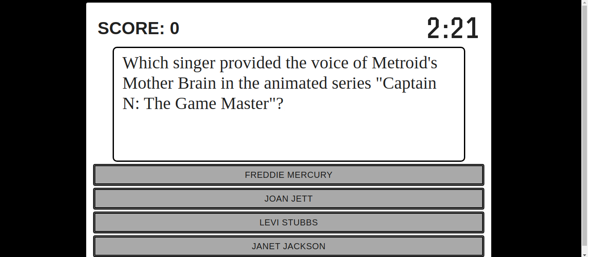
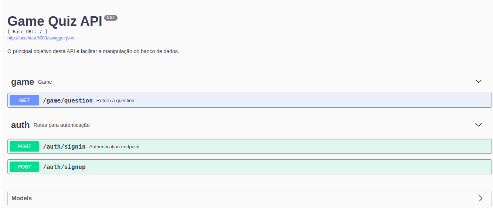

## THE CHALLENGE

Nowadays, it has become popular among internet users to spend some of their time testing their general 
knowledge through quizzes (and brag about it when they ace it). The idea is to design the prototype for a 
quiz app that is pleasant, engaging, and easy to use. In the end, we’ll inform the user about his performance 
and translate those results into a grade.

#### Requirements


Each question has only four possible answers, of which only one is correct.

On top of showing the grade, show statistics on how the user’s answers compared to the other users that 
answered these questions before


We encourage you to work with your creativity, implementing features and quizzes that you would like to see 
and answer

Create an authentication method, and only allow users who were already registered in the database, 
so you will not need to create a signup page.


#### Bonus Features


Allow the user to share the result of his quiz on social media.

Allow multiple quizzes to be administered through the same app.

Record the user’s performance from previous attempts and compare performance improvement over time.

Sign up page for new users.

Testing coverage - Testing is highly encouraged as a bonus feature

## MY SOLUTION
[]() []()


My template base to build is SQL Server on Database, React on frontend and Flask APIs using [Flask RESTPlus](https://flask-restplus.readthedocs.io/en/stable/index.html)


## Requeriments
Install Docker 
```
sudo apt-get install docker-ce docker-ce-cli containerd.io
```

Install Docker Compose
```
sudo curl -L "https://github.com/docker/compose/releases/download/1.27.4/docker-compose-$(uname -s)-$(uname -m)" -o /usr/local/bin/docker-compose
```
## Usage
On docker-compose.yml folder, open terminal and hit:
```
docker-compose up
```
After the application goes up, open your browser on `localhost:3000`



## Swagger

After the application goes up, open your browser on `localhost:5003/docs` to see the self-documented interactive API:




## Backend - Project Structure
``
.
├── alembic.ini
├── api
│   └── blueprints
│       ├── auth
│       │   ├── models.py
│       │   ├── routes.py
│       │   ├── serializers.py
│       │   └── services.py
│       └── game
│           ├── __init__.py
│           ├── routes.py
│           ├── serializers.py
│           └── services.py
├── app.py
├── config.py
├── Dockerfile
├── entrypoint.sh
├── manage.py
├── migrations
├── requirements.txt
└── wait-for-it.sh

```

### Files

* `app` - All the RESTful API implementation is here.
* `app/blueprints` - Resource agroupment for all `v1` [Namespaces](https://flask-restplus.readthedocs.io/en/stable/scaling.html#multiple-namespaces).
* `config.py` - Config file for envs, global config vars and so on.
* `Dockerfile` - Dockerfile used to build a Docker image (using [Docker Multistage Build](https://docs.docker.com/develop/develop-images/multistage-build/))
* `.dockerignore` - Lists files and directories which should be ignored while Docker build process.
* `.gitignore` - Lists files and directories which should not be added to git repository.
* `requirements.txt` - All project dependencies.
* `app.py` - The Application entrypoint.


## Frontend - Project Structure

```
.
.
├── Dockerfile
├── package.json
├── public
├── src
│     ├── App.js
│     ├── App.scss
│     ├── components
│     │     ├── CardAction
│     │     │     ├── index.js
│     │     │     └── styles.scss
│     │     ├── Clock
│     │     ├── IntroWindow
│     │     ├── MainWindow
│     │     ├── Score
│     │     └── TextBox
│     ├── router
│     │     ├── index.js
│     │     ├── PrivateRoute
│     │     ├── PublicRoute
│     │     └── Routes.js
│     ├── store
│     └── views
│         ├── GameOverView
│         │     ├── index.js
│         │     └── styles.scss
│         ├── GameView
│         └── IntroView
└── yarn.lock


```

### Files
* `src/components` - All the UI components.
* `src/router` - All the routes of your projects. 
* `src/store` - The Vuex constants splited in actions, mutations and getters.
* `src/views` -  A template of components on a route.
* `package.json` - The NPM package meta file that contains all the build dependencies and build commands
